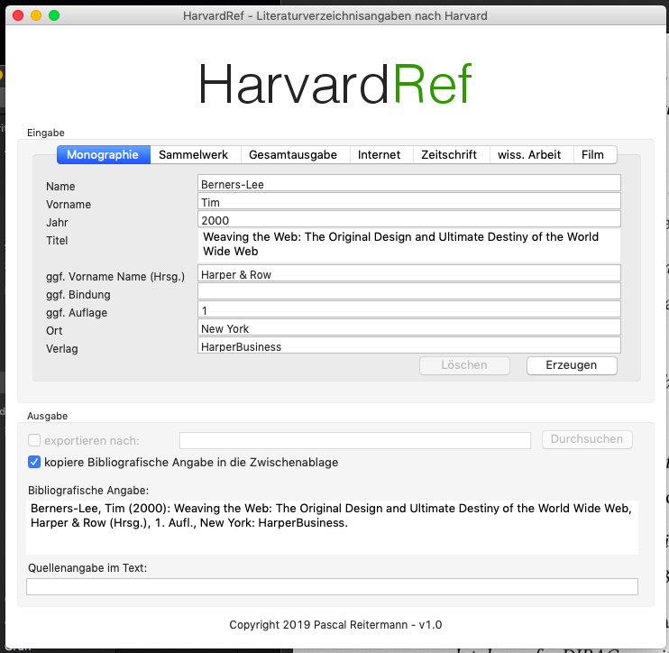

# HarvardRef
This program allows you to create bibliography with references made in harward notation.

### Build
You can build the program with `mvn package`.

### Execute
On OS X you have to start it with parameter `-XstartOnFirstThread`, e.g. `java -XstartOnFirstThread  -jar target/harvardref-1.0.0.jar`.
